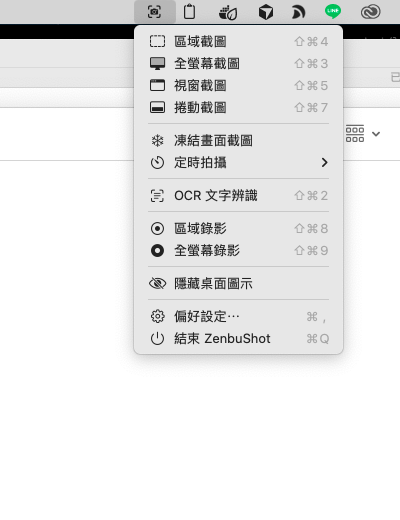
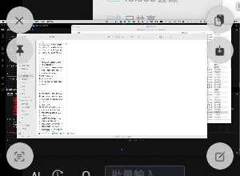
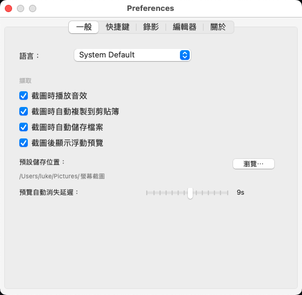
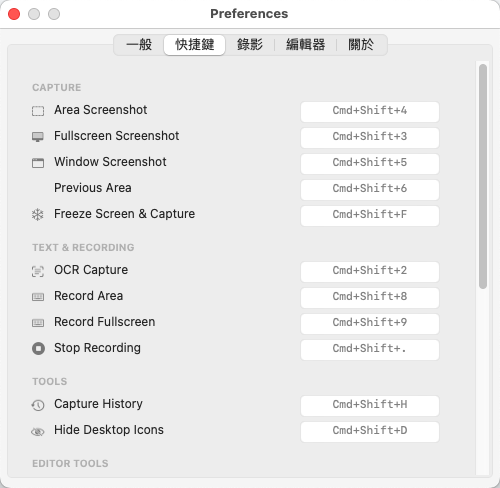

# ZenbuShot

免費、開源的 macOS 截圖與錄影工具。支援區域截圖、全螢幕、視窗、滾動截圖、OCR 文字辨識、螢幕錄影，並內建圖片編輯器。

---

## 截圖

### Menu Bar — 所有功能一鍵觸達



點擊 menu bar 圖示即可存取所有截圖、錄影功能，也可直接用快捷鍵觸發。

### 浮動預覽 — 截完立即動作



截圖完成後自動彈出浮動預覽視窗，hover 後顯示快捷按鈕：複製、儲存、編輯、OCR、釘選。

### 偏好設定 — 完整自訂截圖行為



設定語言、截圖自動複製 / 儲存、預覽消失延遲、預設儲存路徑。

### 快捷鍵 — 所有功能一覽



所有快捷鍵可在偏好設定中確認，預設使用 `Cmd+Shift` 系列。

---

## 功能特色

### 截圖

| 功能 | 快捷鍵 |
|------|--------|
| 區域截圖 | `Cmd+Shift+4` |
| 全螢幕截圖 | `Cmd+Shift+3` |
| 視窗截圖 | `Cmd+Shift+5` |
| 滾動截圖 | `Cmd+Shift+7` |
| 凍結畫面截圖 | `Cmd+Shift+F` |
| OCR 文字辨識 | `Cmd+Shift+2` |

### 錄影

| 功能 | 快捷鍵 |
|------|--------|
| 區域錄影 | `Cmd+Shift+8` |
| 全螢幕錄影 | `Cmd+Shift+9` |
| 停止錄影 | `Cmd+Shift+.` |

> 錄影支援麥克風收音，可匯出 MP4 或 GIF。

### 圖片編輯器

截圖後點擊預覽的「編輯」按鈕即可開啟編輯器，支援以下工具：

- **箭頭** — 標示重點方向
- **文字** — 加入說明文字
- **矩形 / 圓角矩形 / 橢圓** — 框選範圍
- **螢光筆** — 標記重點
- **馬賽克** — 遮蔽敏感資訊
- **模糊** — 柔化特定區域
- **聚光燈** — 突顯特定區域
- **計數器** — 標示步驟序號
- **自由繪圖** — 手繪標記

### 其他

- **定時拍攝** — 3 / 5 / 10 秒倒數後截圖
- **隱藏桌面圖示** — 截圖前清空桌面
- **截圖歷史** — 查看過去的截圖（`Cmd+Shift+H`）
- **釘選截圖** — 讓截圖浮在所有視窗上方

---

## 系統需求

- macOS 13.0 (Ventura) 以上
- Apple Silicon (arm64)

---

## 安裝

前往 [Releases](../../releases) 下載最新的 `ZenbuShot-x.x.x.dmg`，開啟後將 ZenbuShot.app 拖入 `/Applications`。

首次開啟時，系統會要求授予以下權限：
- **螢幕錄製** — 必要，用於截圖與錄影
- **輔助使用** — 必要，用於全域快捷鍵

---

## 從原始碼編譯

需要 macOS Command Line Tools（不需完整 Xcode）：

```bash
git clone https://github.com/lukehsuhao/zenbushot.git
cd zenbushot
bash build.sh
```

編譯完成後，app 會自動部署到 `/Applications/ZenbuShot.app`。
